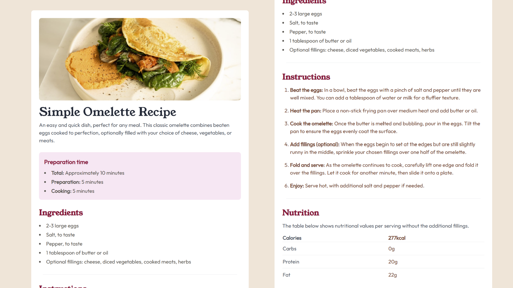
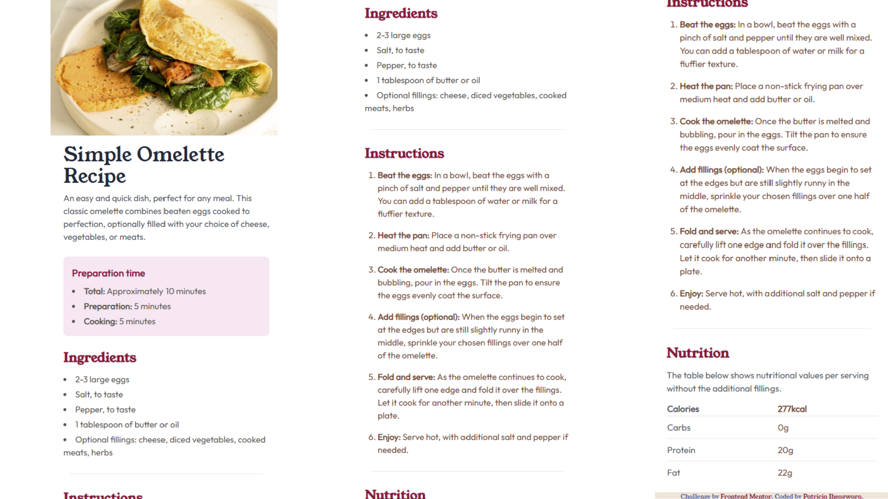

# Frontend Mentor - Recipe page solution

This is a solution to the [Recipe page challenge on Frontend Mentor](https://www.frontendmentor.io/challenges/recipe-page-KiTsR8QQKm). Frontend Mentor challenges help you improve your coding skills by building realistic projects.

## Table of contents

- [Overview](#overview)
  - [Screenshot](#screenshot)
  - [Links](#links)
  - [Built with](#built-with)
  - [What I learned](#what-i-learned)
  - [Continued development](#continued-development)
  - [Useful resources](#useful-resources)
- [Author](#author)

## Overview

### Screenshot





### Links

- Solution URL: [Add solution URL here](https://your-solution-url.com)
- Live Site URL: [Add live site URL here](https://your-live-site-url.com)


### Built with

- Semantic HTML5 markup
- [Tailwind CSS](https://tailwindcss.com/) - A utility-first CSS framework
- Mobile-first workflow

### What I learned

Here are some key takeaways from this project:

- Improved understanding of **Tailwind CSS utility classes** and how they can be used to build responsive and aesthetically pleasing designs quickly.
- Practiced creating a **mobile-first workflow**, ensuring the site is fully responsive across devices.
- Gained more experience structuring HTML to be semantic and accessible.

To see how you can add code snippets, see below:

```html and tailwind css
<div class="bg-pink-100 p-4 rounded-lg mb-6 px-4 font-outfit">
  <h3 class="font-semibold text-lg text-rose-800">Preparation time</h3>

  <ul class="list-disc list-inside mt-2 text-stone-600 space-y-1 ">
    <li><span class="font-bold">Total:</span> Approximately 10 minutes</li>
    <li><span class="font-bold">Preparation:</span> 5 minutes</li>
    <li><span class="font-bold">Cooking:</span> 5 minutes</li>
  </ul>
</div>
```

### Continued development

In future projects, I want to focus on improving my responsiveness skills to ensure that my designs look seamless across all screen sizes. Additionally, I aim to deepen my understanding of advanced Tailwind CSS concepts, such as customizing themes and working with utility-first animations.

I also plan to explore accessibility best practices to make my projects more inclusive, as well as refine my workflow when using tools like Flexbox and Grid for complex layouts. These are areas where I see room for growth and believe they will elevate the quality of my future projects.

### Useful resources

- [Tailwind CSS Documentation](https://www.tailwindcss.com) - This resource provided clear and concise explanations of utility classes, helping me structure my styles more efficiently. It's a must-read for anyone working with Tailwind CSS.
- [Flowbite](https://www.flowbite.com) - This article introduced me to prebuilt components that seamlessly integrate with Tailwind CSS. It was instrumental in speeding up my development process.
- [Frontend Mentor Submission Guide ](https://medium.com/frontend-mentor/a-complete-guide-to-submitting-solutions-on-frontend-mentor-ac6384162248) - This guide was invaluable for understanding the steps involved in submitting my projects on Frontend Mentor. I'd recommend it to anyone tackling their challenges.

## Author

- Website - [Patricia Iheagwara](https://devwithpatricia.netlify.app/)
- Frontend Mentor - [@codeWithPatricia](https://www.frontendmentor.io/profile/codeWithPatricia)


